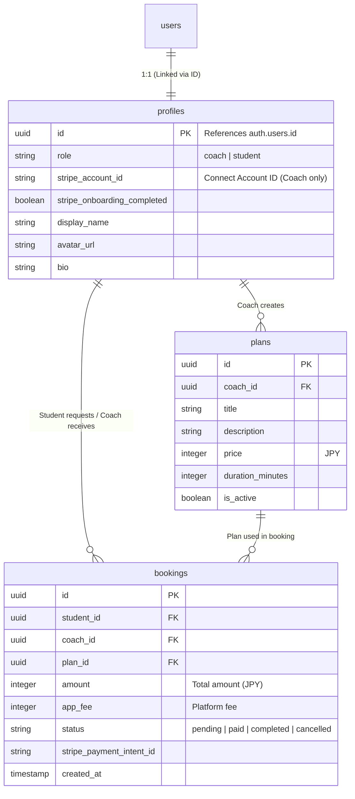

# データベーススキーマ設計書

本プロジェクトでは **Supabase (PostgreSQL)** を使用します。
認証 (`auth.users`) と連携し、Stripe Connect による決済フローをサポートするためのスキーマを定義します。

## 1. ER図 (概略)

## 2. テーブル定義詳細

### 2.1. `public.profiles`
ユーザーの基本情報と役割、およびStripe連携状態を管理します。
`auth.users` テーブルの `id` と 1:1 で紐付きます。

| カラム名 | データ型 | 制約 | 説明 |
| --- | --- | --- | --- |
| `id` | `uuid` | PK, FK(`auth.users.id`) | ユーザーID |
| `role` | `text` | Not Null, Check(`'coach'`, `'student'`) | ユーザーの役割 |
| `display_name` | `text` | | 表示名 |
| `avatar_url` | `text` | | アバター画像URL |
| `bio` | `text` | | 自己紹介・経歴など |
| `stripe_account_id` | `text` | Unique, Nullable | Stripe Connect Account ID (`acct_...`)。コーチのみ。 |
| `stripe_onboarding_completed` | `boolean` | Default `false` | Stripeのオンボーディングが完了したか |
| `created_at` | `timestamptz` | Default `now()` | 作成日時 |
| `updated_at` | `timestamptz` | Default `now()` | 更新日時 |

### 2.2. `public.plans`
コーチが提供するコーチングプラン（商品）を定義します。

| カラム名 | データ型 | 制約 | 説明 |
| --- | --- | --- | --- |
| `id` | `uuid` | PK, Default `gen_random_uuid()` | プランID |
| `coach_id` | `uuid` | FK(`profiles.id`), Not Null | 作成したコーチのID |
| `title` | `text` | Not Null | プラン名 (例: "1時間コーチング") |
| `description` | `text` | | 詳細説明 |
| `price` | `integer` | Not Null, Check(`price >= 0`) | 価格 (日本円) |
| `duration_minutes` | `integer` | Not Null | 所要時間 (分) |
| `is_active` | `boolean` | Default `true` | 有効/無効フラグ |
| `created_at` | `timestamptz` | Default `now()` | 作成日時 |
| `updated_at` | `timestamptz` | Default `now()` | 更新日時 |

### 2.3. `public.bookings`
コーチングの予約および決済トランザクションを管理します。

| カラム名 | データ型 | 制約 | 説明 |
| --- | --- | --- | --- |
| `id` | `uuid` | PK, Default `gen_random_uuid()` | 予約ID |
| `student_id` | `uuid` | FK(`profiles.id`), Not Null | 予約した生徒のID |
| `coach_id` | `uuid` | FK(`profiles.id`), Not Null | 予約されたコーチのID |
| `plan_id` | `uuid` | FK(`plans.id`), Nullable | 選択されたプランID (将来的にAd-hoc対応のためNullable) |
| `amount` | `integer` | Not Null | 支払い総額 (JPY) |
| `application_fee_amount` | `integer` | Not Null | プラットフォーム手数料 (JPY) |
| `transfer_amount` | `integer` | Not Null | コーチへの送金予定額 (JPY) |
| `currency` | `text` | Default `'jpy'` | 通貨 |
| `status` | `text` | Default `'pending'`, Check(`'pending'`, `'paid'`, `'completed'`, `'cancelled'`) | ステータス |
| `stripe_payment_intent_id` | `text` | Unique, Nullable | Stripe Payment Intent ID (`pi_...`) |
| `session_date` | `timestamptz` | Nullable | (PoCでは口頭調整だが、記録用に任意入力可) |
| `created_at` | `timestamptz` | Default `now()` | 作成日時 |
| `updated_at` | `timestamptz` | Default `now()` | 更新日時 |

## 3. Row Level Security (RLS) ポリシー方針

### `profiles`
- **SELECT**: 全員許可 (Public)。コーチ一覧表示などのため。
- **UPDATE**: 本人のみ許可 (`auth.uid() == id`)。
- **INSERT**: トリガー経由で行うため、直接のINSERTは基本禁止 (または本人のみ)。

### `plans`
- **SELECT**: 全員許可 (Public)。
- **INSERT/UPDATE/DELETE**: プランの所有者 (`coach_id == auth.uid()`) のみ許可。

### `bookings`
- **SELECT**: 関係者のみ許可 (`student_id == auth.uid()` OR `coach_id == auth.uid()`)。
- **INSERT**: 生徒のみ許可 (`student_id == auth.uid()`)。
- **UPDATE**: 関係者のみ許可 (ステータス更新など)。ただし、重要なステータス変更はサーバーサイド(Edge Functions)から行うことを推奨。

## 4. トリガー / Functions

### `handle_new_user`
- `auth.users` に新規ユーザーが登録された際、自動的に `public.profiles` にレコードを作成するトリガー関数。
- ユーザーメタデータから `role` や `display_name` を取得して保存する。

### `update_updated_at`
- レコード更新時に `updated_at` を自動更新する汎用トリガー。

## 5. 予約フローとデータライフサイクル

`bookings` テーブルは、予約の状態だけでなく、お金の分配（手数料 vs コーチ報酬）を確定させるための重要な台帳です。

### 1. 予約作成 (Booking Initiation)
生徒が予約リクエストを行った初期状態です。
- **Status**: `'pending'`
- **`amount`**: `plans` テーブルの価格をコピーして保存します。プラン価格が後で変更されても、予約時の合意価格を保持するためです。
- **`transfer_amount` / `application_fee_amount`**: 総額から手数料を計算し、それぞれの取り分を確定させて保存します。

### 2. 決済処理 (Payment Processing)
Stripe PaymentIntent を作成し、決済を開始します。
- **`stripe_payment_intent_id`**: Stripeの `pi_...` IDを保存し、この予約レコードとStripeの決済トランザクションを 1:1 で紐付けます。

### 3. 決済完了 (Payment Success)
生徒の支払いが完了した状態です。
- **Status**: `'pending'` -> `'paid'`
- これにより予約が確定します。

### 4. コーチング実施・完了 (Session Completion)
コーチングサービスが提供された後の状態です。
- **Status**: `'paid'` -> `'completed'`
- 将来的に、このステータス変更をトリガーにレビュー依頼や売上確定処理を行います。

### 5. キャンセル (Cancellation)
予約がキャンセルされ、返金処理が行われた状態です。
- **Status**: `'cancelled'`
