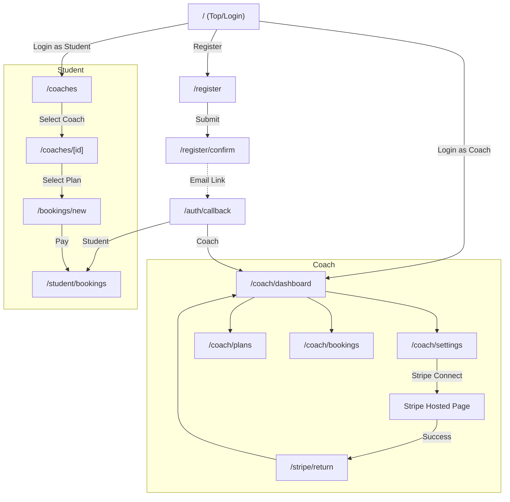

# 画面設計書 (Screen Design)

本ドキュメントは、PoCにおけるアプリケーションの画面構成、パス、および主要な機能を定義します。

## 1. 共通 / 認証 (Common / Auth)

| 画面名 | パス | 概要 | 主要要素・アクション |
| --- | --- | --- | --- |
| **トップページ / ログイン** | `/` | アプリケーションの入り口。未ログイン時はログインを促す。 | ・サービスロゴ/説明 ・ログインフォーム ・新規登録リンク |
| **アカウント登録** | `/register` | 新規ユーザー登録画面。 | ・メールアドレス/パスワード入力 ・ロール選択 (生徒/コーチ) ・登録ボタン |
| **メール確認待ち** | `/register/confirm` | 認証メール送信完了を通知する画面。 | ・認証メール送信メッセージ ・メール確認のお願い ・ログインページへのリンク |
| **認証コールバック** | `/auth/callback` | Supabase Authのリダイレクト先 (画面としては意識しない)。 | ・セッション確立処理 ・プロフィール作成 ・ロールに応じたリダイレクト (コーチor生徒) |

## 2. コーチ向け画面 (Coach Views)

コーチ (`role: 'coach'`) が利用する画面群です。

| 画面名 | パス | 概要 | 主要要素・アクション |
| --- | --- | --- | --- |
| **コーチダッシュボード** | `/coach/dashboard` | コーチのホーム画面。売上や予約状況を概観する。 | ・今月の売上概算 ・直近の予約リスト ・「Stripe連携」ステータス/ボタン |
| **プロフィール設定** | `/coach/settings` | 自身のプロフィールとStripe連携状態を管理する。 | ・プロフィール編集 (名前, Bio, アバター) ・Stripe Connect連携ボタン (未連携時) ・Stripeダッシュボードへのリンク (連携済時) |
| **プラン管理** | `/coach/plans` | 販売するコーチングプランの一覧と作成・編集。 | ・プラン一覧表示 ・「新規プラン作成」ボタン ・プラン編集/削除アクション |
| **予約管理** | `/coach/bookings` | 生徒からの予約一覧を確認する。 | ・予約リスト (ステータス別) ・予約詳細確認 |

## 3. 生徒向け画面 (Student Views)

生徒 (`role: 'student'`) が利用する画面群です。

| 画面名 | パス | 概要 | 主要要素・アクション |
| --- | --- | --- | --- |
| **コーチ一覧 (トップ)** | `/coaches` | 登録されているコーチの一覧を表示する (PoCでは実質1名)。 | ・コーチカード一覧 (名前, Bio, アバター) ・詳細ページへのリンク |
| **コーチ詳細 / プラン選択** | `/coaches/[id]` | 特定のコーチの詳細情報と、提供プランを表示する。 | ・コーチプロフィール詳細 ・プラン一覧 ・「予約する」ボタン (各プラン) |
| **予約・決済画面** | `/bookings/new` | 選択したプランの確認と支払いを行う。 | ・選択プラン情報 (タイトル, 金額) ・Stripe Payment Element (カード入力) ・「支払う」ボタン |
| **マイページ / 予約履歴** | `/student/bookings` | 自身の予約履歴を確認する。 | ・過去/現在の予約リスト ・ステータス確認 (支払済, 完了など) |

## 4. Stripe関連 (Stripe Related)

Stripe Connectのフローで使用されるシステム画面です。

| 画面名 | パス | 概要 | 主要要素・アクション |
| --- | --- | --- | --- |
| **連携リターン** | `/stripe/return` | Stripeオンボーディング完了後の戻り先。 | ・連携成功メッセージ ・ダッシュボードへのリダイレクト |
| **連携リフレッシュ** | `/stripe/refresh` | Stripeオンボーディング中断/失敗時の戻り先。 | ・再試行ボタン ・エラーメッセージ |

## 5. 画面遷移図 (簡易)

